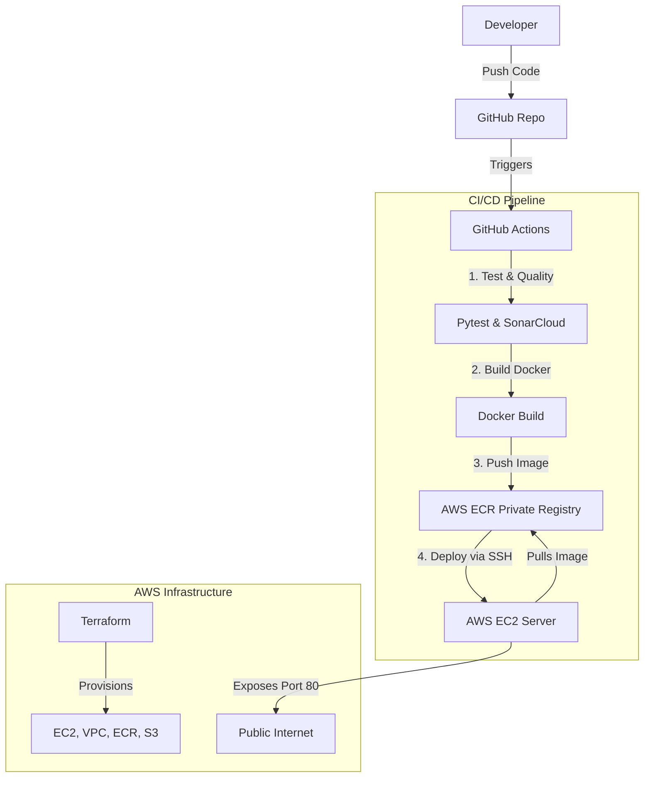
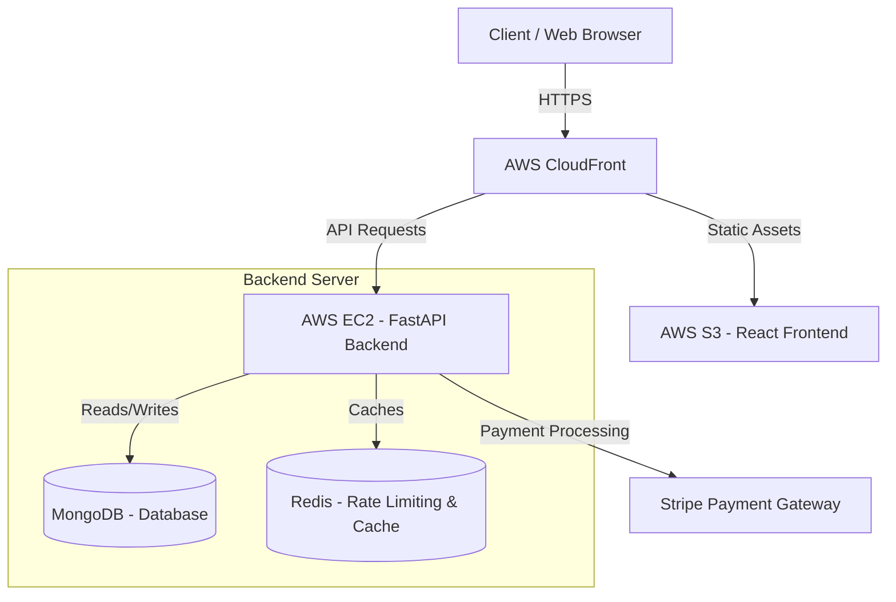
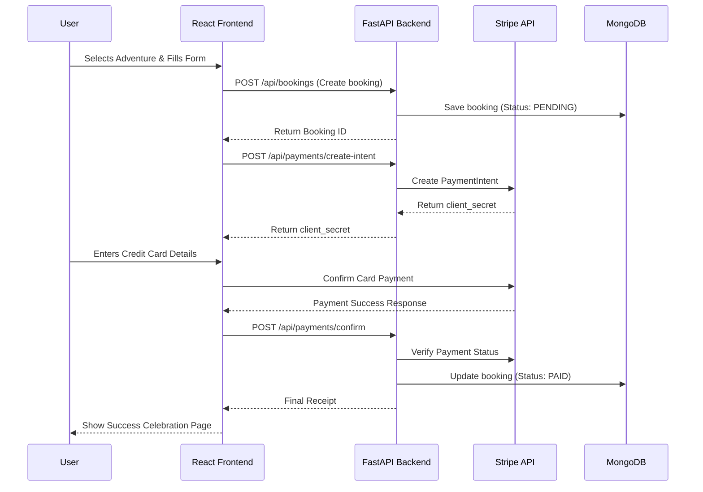

# FastAPI Backend

Clean architecture FastAPI project with MongoDB.

## Features
- **FastAPI** (High performance, easy to learn, fast to code, ready for production)
- **MongoDB** (Motor async driver)
- **Authentication** (JWT with HTTPBearer security scheme)
- **Environment Separation** (Dev/Prod configurations)
- **Testing** (Pytest coverage for Auth and Bookings)
- **Docker & Docker Compose**

## 🚀 DevOps Architecture

This project uses a fully automated **CI/CD Pipeline** to deploy code to AWS.



### How It Works
1.  **Infrastructure as Code (Terraform)**: All AWS resources (Servers, Networks, Databases) are created automatically using Terraform code.
2.  **Continuous Integration (CI)**:
    *   Every push runs **Pytest** to ensure code works.
    *   **SonarCloud** scans for code quality and bugs.
3.  **Continuous Deployment (CD)**:
    *   If tests pass, we build a **Docker Image**.
    *   The image is pushed to **AWS ECR** (Amazon's Docker Registry).
    *   We automatically SSH into the **EC2 Server**, pull the new image, and restart the app.

## 🏗️ System Architecture

This diagram illustrates the high-level infrastructure and component layout of the production environment.



## 🗺️ User Journey & Payment Flow

When a user books an adventure, the frontend and backend orchestrate a secure checkout process utilizing Stripe intents.



## Setup

### 1. Environment Variables
The system now uses separated environment files.
- `.env.dev`: Development configuration
- `.env.prod`: Production configuration

**Auto-setup for Docker:**
A local `.env` file (copy of `.env.dev`) is required for `docker-compose` to start without arguments.
```bash
cp .env.example .env.dev
cp .env.dev .env  # Required for default docker-compose up
```

### 2. Docker
Run the application container:
```bash
docker-compose up -d --build
```
The API will be available at `http://localhost:8000`.

### 3. Local Development (No Docker)
If you wish to run locally:
```bash
# Set environment
export ENVIRONMENT=dev  # Uses .env.dev

pip install -r requirements.txt
uvicorn app.main:app --reload
```

## Authentication & Swagger UI
1. Go to `http://localhost:8000/docs`.
2. Use the `/api/auth/register` endpoint to create a user.
3. Use the `/api/auth/login` endpoint to get an `access_token`.
4. Click the **Authorize** button at the top of the page.
5. Paste your `access_token` into the box.
6. You can now access protected endpoints like `GET /api/bookings`.

## Testing
Unit tests are included for Authentication and Booking flows.
**Run tests inside Docker (recommended):**
```bash
docker-compose exec backend pytest -v tests/
```

**Run local tests:**
```bash
export ENVIRONMENT=dev
pytest -v tests/
```

## Project Structure
- `app/core`: Configuration, Database, Security
- `app/models`: Database models
- `app/schemas`: Pydantic data schemas
- `app/routes`: API route handlers
- `tests/`: Unit and integration tests
