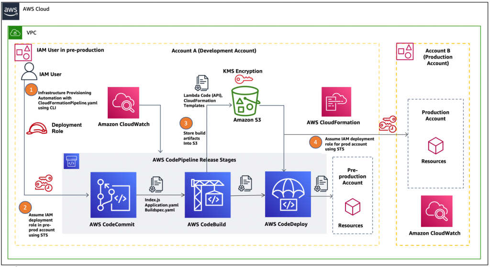

# Adventure Booking System - Backend

The **Adventure Booking System** is a scalable, cloud-native reservation platform designed for high availability and security. It enables users to browse and book adventure rides while providing administrators with a central management portal.



## 🏗️ System Design & Architecture

The system follows a modern DevOps practices and Cloud-Native architecture, leveraging AWS services for robust deployment, monitoring, and security.

### 1. Cloud Infrastructure (AWS)
The architecture is divided into multiple environments (Development, Pre-Production, Production) to ensure safe deployment cycles.

*   **VPC (Virtual Private Cloud)**: Isolates the network resources.
*   **IAM (Identity and Access Management)**: Manages permissions securely with role-based access control (RBAC).
    *   Separate roles for Development and Production accounts.
    *   Cross-account access via STS (Security Token Service).
*   **KMS (Key Management Service)**: Encrypts sensitive data and artifacts in S3.
*   **Amazon CloudWatch**: Provides centralized monitoring and logging across all environments.

### 2. CI/CD Pipeline
We utilize a fully automated pipeline for "Infrastructure as Code" and application deployment.

1.  **Source Control (AWS CodeCommit)**: hosts the source code and configuration files (`buildspec.yaml`, `Application.yaml`).
2.  **Build (AWS CodeBuild)**: Compiles the application, runs tests, and packages artifacts.
    *   Build artifacts are stored securely in **Amazon S3**.
3.  **Deploy (AWS CodeDeploy)**: Automates the deployment of the application to the resources.
    *   Utilizes **AWS CloudFormation** to provision infrastructure resources (IaC).
    *   Deploys changes first to the Pre-production account, then to Production upon verification.

### 3. Application Architecture
The backend is built with **FastAPI**, creating a high-performance, asynchronous RESTful API.

*   **Language**: Python 3.11+
*   **Framework**: FastAPI (REST API), Pydantic (Data Validation).
*   **Database**: MongoDB (NoSQL) for flexible schemas and scalability.
    *   **Driver**: `motor` (AsyncIO).
    *   **ODM**: Custom Pydantic models for `Ride` and `Booking`.
*   **Containerization**: Docker & Docker Compose for consistent development and deployment environments.

---

## 📂 Data Models

The system is designed around two core entities: **Ride** and **Booking**.

### Ride (Adventure)
Represents the adventure services available for booking.
*   **Fields**: `title`, `description`, `price`, `location`, `date`, `max_seats`, `available_seats`.
*   **Dynamic**: Admins can add new types of adventures without code changes.

### Booking
Represents a user's reservation for a specific ride.
*   **User Details**: Captured at booking time (no mandatory user account registration).
    *   `full_name`, `email`, `phone`.
*   **Consent**: Mandatory boolean flag for health & safety waivers.
*   **Status**: `PENDING`, `CONFIRMED`, `CANCELLED`.

---

## 🚀 Getting Started

### Prerequisites
*   Docker & Docker Compose
*   Python 3.11+ (for local logic)

### Running with Docker (Recommended)
This runs the full backend stack including the MongoDB connection.

```bash
# 1. Clone the repository
git clone <repository-url>
cd backend

# 2. Setup environment variables
cp .env.example .env
# Ensure .env has valid MONGODB_URL and DATABASE_NAME

# 3. Start the application
docker compose up --build
```
The API will be available at: [http://localhost:8000](http://localhost:8000)

*   **Swagger UI**: [http://localhost:8000/docs](http://localhost:8000/docs)
*   **ReDoc**: [http://localhost:8000/redoc](http://localhost:8000/redoc)

### Local Development
To run without Docker for development:

```bash
# Install dependencies
pip install -r requirements.txt

# Run server
uvicorn app.main:app --reload
```

---

## 🔮 Future Roadmap

*   **API Implementation**: Building the CRUD endpoints for Rides and Bookings.
*   **Admin Authentication**: Secure login for the admin portal.
*   **Email Notifications**: Integration with AWS SES for booking confirmations.
*   **Payment Integration**: Stripe API for processing booking payments.
